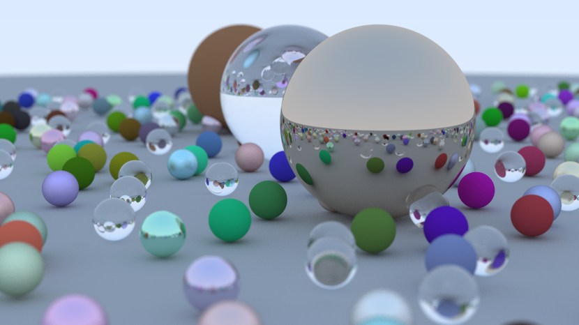

Raytracer
=========

Based on the book Ray Tracing in One Weekend [[1]](#1).

Currently only renders spheres. Supports lambertian, metallic, and dielectric
materials. All rendering is done on CPU with Rayon for parallelisation. A BVH is
used for acceleration.

A SBVH [[2]](#2) implementation is WIP.

Usage
-----

    cargo run -r > image.ppm

Configure the camera and scene by editing the `src/main.rs` file.

The program outputs images in the PPM format [[3]](#3) to stdout.

References
----------

<a id="1">[1]</a>https://raytracing.github.io/books/RayTracingInOneWeekend.html  
<a id="2">[2]</a>https://www.nvidia.in/docs/IO/77714/sbvh.pdf  
<a id="3">[2]</a>https://en.wikipedia.org/wiki/Netpbm